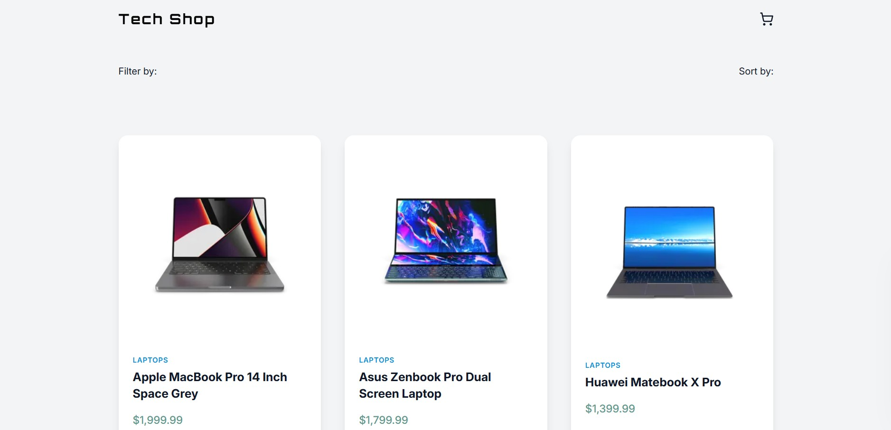
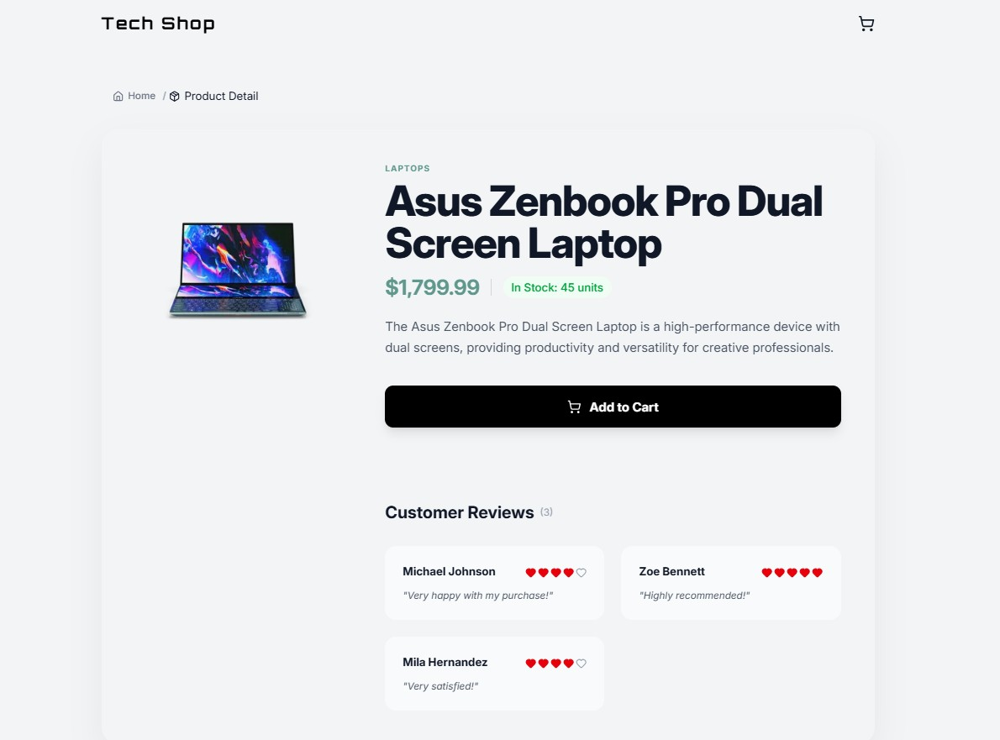
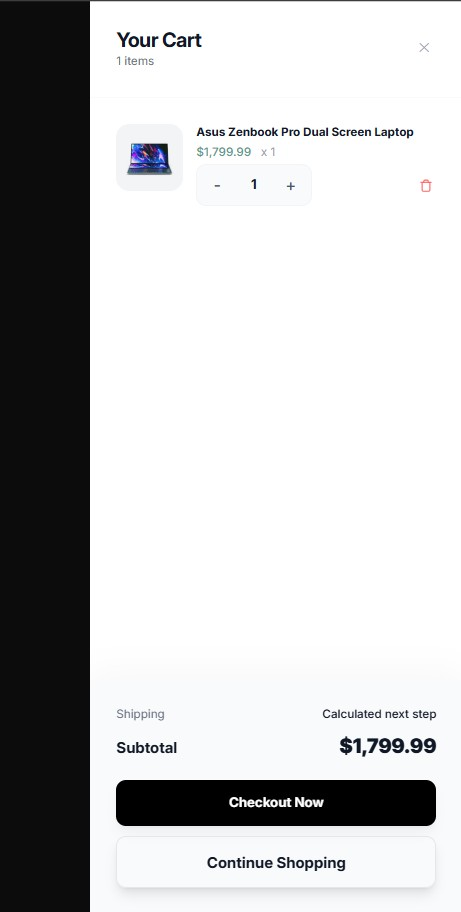
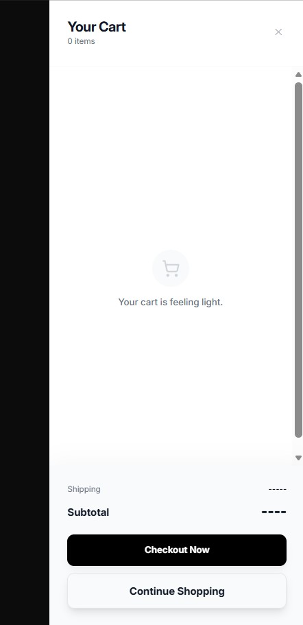
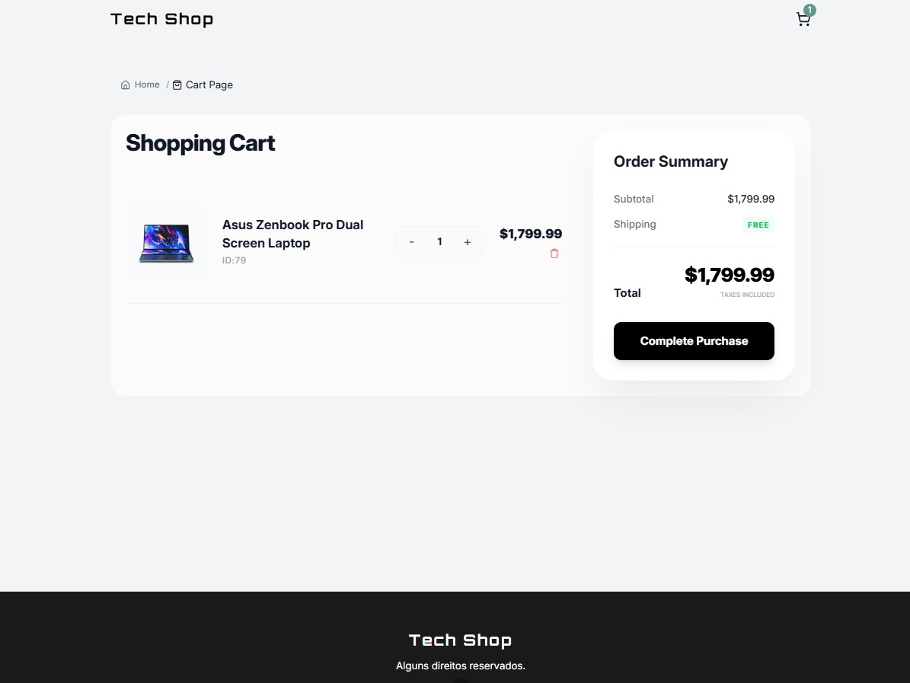
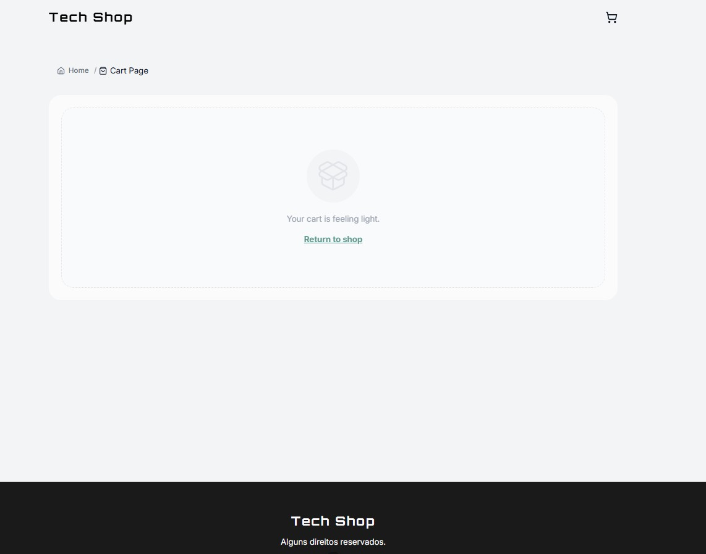

<div align="left" style="position: relative;">

<h1>TECH-SHOP</h1>
<p align="center">
   <b>English</b> | 
   <a href="README.pt.md">Português</a> | 
   <a href="README.es.md">Español</a>
</p>
<p align="left">
	<em><code>❯ A modern, fast, and intuitive e-commerce platform for selling tech products.</code></em>
</p>



<p align="left">Built with the tools and technologies:</p>
<p align="center">
	
	
	
	
	
	
	
</p>
</div>
<br clear="right">

## 🔗 Quick Links

- [📍 Overview](#-overview)
- [📸 Screenshots](#-screenshots)
- [👾 Features](#-features)
- [📁 Project Structure](#-project-structure)
  - [📂 Project Index](#-project-index)
- [🚀 Getting Started](#-getting-started)
  - [☑️ Prerequisites](#-prerequisites)
  - [⚙️ Installation](#-installation)
  - [🤖 Usage](#🤖-usage)
- [📈 Next Steps](#-next-steps)
- [🔗 Links & Contacts](#-links-&-contacts)
- [🎗 License](#-license)
- [🙌 Acknowledgments](#-acknowledgments)

---

## 📍 Overview

<code>❯ TECH-SHOP is a high-performance e-commerce platform for tech products. Built with Vue.js 3, TypeScript, Tailwind CSS, and Vite, and powered by the <a href="https://dummyjson.com/" target="_blank">DummyJSON</a> API, the project combines a fluid, reactive interface with a secure, ultra-fast ecosystem, ensuring the ultimate shopping experience for the user.</code>

---

## 📸 Screenshots

<details>
  <summary>📸 Click to view Screenshots</summary>
  
  ### Main
  

### Product Detail



### Side Cart



### Side Cart (Empty)



### Cart Page



### Cart Page (Empty)



</details>

---

## 👾 Features

- 🛒 **Advanced Cart:** Full CRUD functionality (Add, Read, Update, Delete) with real-time updates.
- 📦 **State Management:** Centralized and optimized global state powered by **Pinia**.
- 💾 **Persistent Storage:** Data retention for user sessions and cart items managed via custom **utility functions** for LocalStorage.
- 🔔 **Handcrafted Toast Notifications:** A custom, lightweight notification system built entirely from scratch using Vue **Composables** for real-time user feedback.
- 🔢 **Reactive Totals:** Automatic calculation of subtotals and taxes directly through the state store.
- 🎨 **Modern UI:** Clean, componentized interface built with **Tailwind CSS**.
- 📱 **Fully Responsive:** Mobile-first design that adapts perfectly to any screen size.
- ⚡ **Optimized Performance:** Blazing fast development and production builds via **Vite**, featuring _lazy loading_ for main routes.
- 🏷️ **Dynamic Page Titles:** Automated browser title updates during navigation, managed dynamically via **Vue Router** meta fields.
- 🌿 **GitFlow Workflow:** Project developed using strict branching models (`main`, `develop`, `feature/*`) ensuring clean history and release organization.

---

## 📁 Project Structure

```sh
└── tech-shop/
    ├── README.md
    ├── env.d.ts
    ├── index.html
    ├── package-lock.json
    ├── package.json
    ├── public
    │   └── favicon.svg
    ├── src
    │   ├── App.vue
    │   ├── assets
    │   ├── components
    │   ├── composables
    │   ├── main.ts
    │   ├── router
    │   ├── store
    │   ├── types
    │   ├── utils
    │   └── views
    ├── tsconfig.app.json
    ├── tsconfig.json
    ├── tsconfig.node.json
    └── vite.config.ts
```

---

## 🚀 Getting Started

### ☑️ Prerequisites

Before getting started with tech-shop, ensure your runtime environment meets the following requirements:

- **Runtime Environment:** Node.js (v18.x or higher)
- **Package Manager:** npm (v9.x or higher)

### ⚙️ Installation

Install tech-shop using one of the following methods:

**Build from source:**

1. Clone the tech-shop repository:

```sh
 git clone https://github.com/wan0805/tech-shop
```

2. Navigate to the project directory:

```sh
 cd tech-shop
```

3. Install the project dependencies:

```sh
 npm install
```

### 🤖 Usage

Run tech-shop using the following command:
**Using `npm`** &nbsp;

```sh
npm run dev
```

To build the project for production:

```sh
 npm run build
```

---

## 📈 Next Steps

- [ ] **`Task 1`**: Implement unit tests using Vitest.

---

## 🔗 Links & Contacts

[](https://github.com/wan0805/tech-shop)

[](https://tech-shop-eta-ten.vercel.app/)

[](https://www.linkedin.com/in/wanderson-duarte-a9778711b)

---

## 🎗 License


This project is licensed under the MIT License - see the [LICENSE](/LICENSE) file for details.

---

## 🙌 Acknowledgments

- [DummyJSON API](https://dummyjson.com/) - For providing the free and stable REST API with tech product data, categories, and images.
- [Vue.js Ecosystem](https://vuejs.org/) - For the excellent documentation of Vue 3, Pinia, and Vue Router.
- [Tailwind CSS Components](https://tailwindcss.com/) - For the styling utilities that allowed the creation of a modern and responsive interface ultra-fast.
- [Shields.io](https://shields.io/) - For the dynamic and static badges used in the styling of this README.

---
